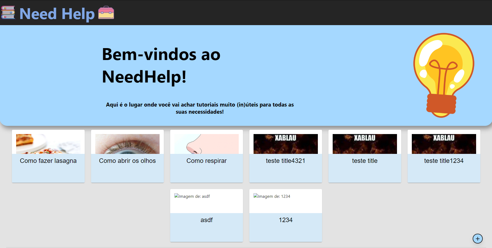
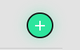
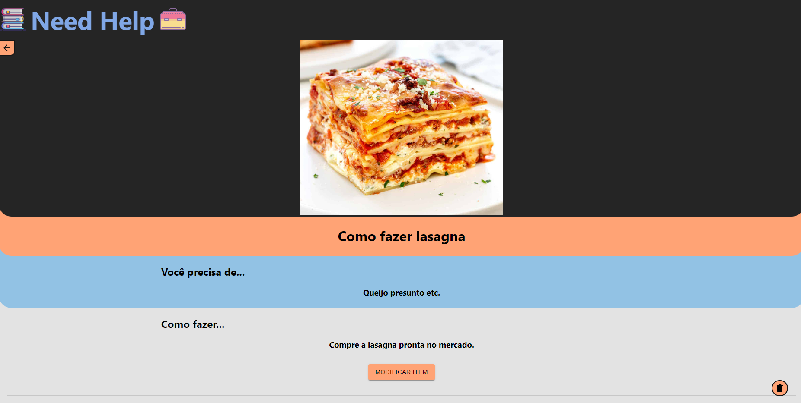
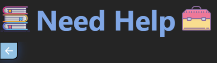
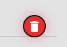
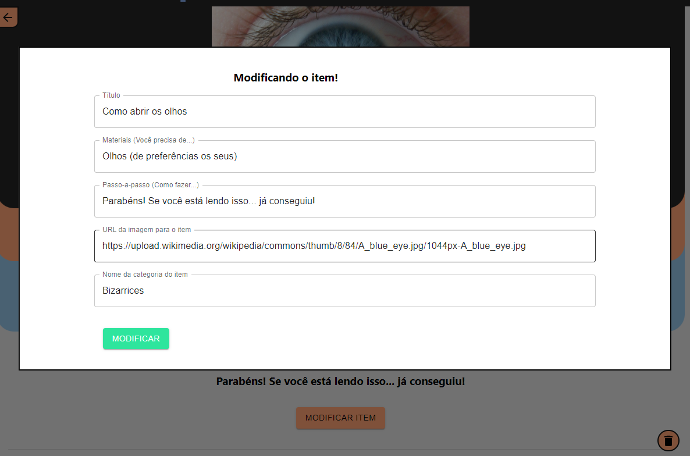
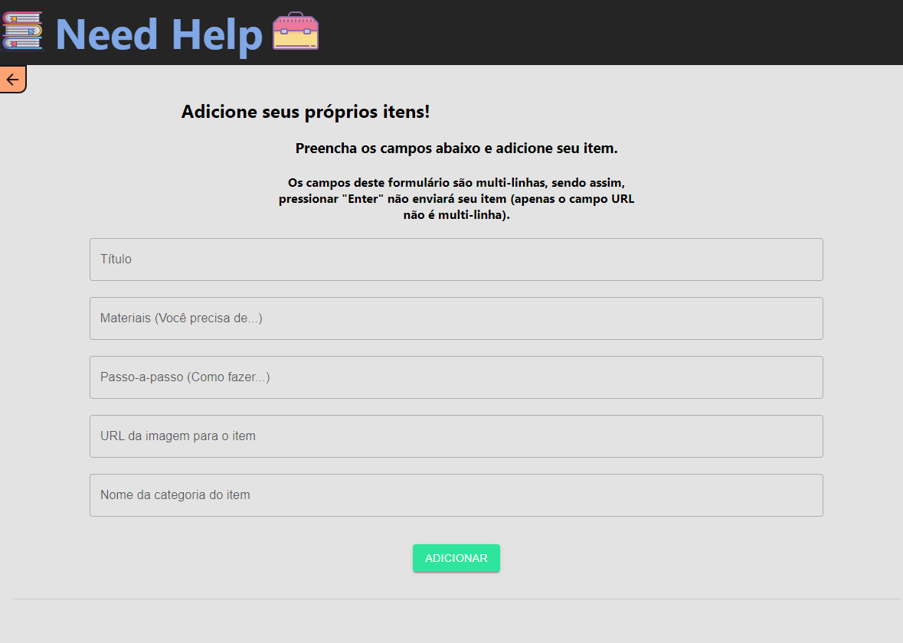

# fiap-grupoj-fase3-entrega3-ReactForSpring
Entrega 3 da Fase 3 do MBA de full stack development da FIAP pelo grupo J.

## Pré-requesitos

Para que este projeto funcione corretamente, é necessário que o projeto presente em <a href="https://github.com/Bullamano/fiap-grupoj-fase3-entrega2-Spring">fiap-grupoj-fase3-entrega2-Spring</a> esteja rodando na máquina e que as instruções da secção "Como rodar o projeto" tenham sido seguidas (pois aquele projeto funciona como o backend deste).

Este projeto é uma evolução do projeto presente em <a href="https://github.com/Bullamano/fiap-grupoj-fase3-entrega1-React">fiap-grupoj-fase3-entrega1-React</a> e pode ser rodado da mesma maneira: através do comando "<i>npm start</i>" na raiz do projeto.

## Need Help, o site mais (in)útil para seus tutoriais

Com base em sites como o WikiHow e canais do youtube como o "Dad, how do I...", foi criado este protótipo: um site para criar e manter tutoriais para ações e coisas do dia a dia (neste protótipo, com cards mais voltados para situações inusitadas e um tom mais humorístico). Abaixo temos as telas da aplicação e explicações acerca de seu funcionamento.

Este projeto, como informado anteriormente, é o frontend do projeto <a href="https://github.com/Bullamano/fiap-grupoj-fase3-entrega2-Spring">fiap-grupoj-fase3-entrega2-Spring</a>.

### Rodando o projeto

O projeto é feito inteiramente em ReactJS e não precisa de configurações anteriores para ser rodado (apenas que o projeto Spring informado anteriormente já esteja rodando na mesma máquina). Basta ter NodeJS e as dependencias instaladas em sua máquina e rodar o comando "<i>npm start</i>".

  ##

### Home Screen

A tela principal da aplicação consiste em um <i>hub</i> com os diversos tutoriais presentes, fornecidos pela API:

  

Nesta tela, há um botão de adição, que leva para a tela de adição de itens, que será mostrada mais a frente.

  

  ##
  
### Tutorial Screen

Ao clicar em qualquer um dos tutoriais da tela principal, uma nova tela aparecerá, sendo populada com as informações daquele tutorial:

  

Esta tela possui três botões importantes:

<ul>
  <li>
    O botão de retorno para a tela principal (o que pode ser realizado clicando no botão ou no símbolo do site);
    

      
    

  </li>

  <li>
    O botão para deletar itens, que envia uma requisição de delete para a API;
    

      
    

  </li>
  
  <li>
    E por último o botão de modificar na parte inferior da tela, que permite modificar um item através de um modal.
    

      
    

  </li>
</ul>

  ##

### Adding Screen

Além de visualizar, o site também permite adicionar seus próprios items. Isso é feito através do botão de adição na Home Screen. Ele redireciona o usuário para a tela de adição. Lá, podem ser fornecidas as informações que serão usadas para registrar o novo item.

  

  ##
